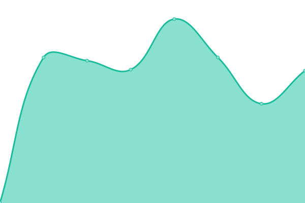

# [📈 Live Status](https://upptime.github.io/upptime): <!--live status--> **🟧 Partial outage**

This repository contains the open-source uptime monitor and status page for [Upptime](https://upptime.js.org), powered by [Upptime](https://github.com/upptime/upptime).

With [Upptime](https://upptime.js.org), you can get your own unlimited and free uptime monitor and status page, powered entirely by a GitHub repository. We use [Issues](https://github.com/upptime/upptime/issues) as incident reports, [Actions](https://github.com/upptime/upptime/actions) as uptime monitors, and [Pages](https://upptime.github.io/upptime) for the status page.

<!--start: status pages-->
<!-- This summary is generated by Upptime (https://github.com/upptime/upptime) -->
<!-- Do not edit this manually, your changes will be overwritten -->
<!-- prettier-ignore -->
| URL | Status | History | Response Time | Uptime |
| --- | ------ | ------- | ------------- | ------ |
|  [Vezgammont](https://vezgammon.it) | 🟩 Up | [vezgammont.yml](https://github.com/samuelemusiani/status.vezgammon.it/commits/HEAD/history/vezgammont.yml) | 

 534ms
     
 | 

<a href="https://upptime.github.io/upptime/history/vezgammont">3.52%</a>
    

|  [Gitlab](https://gitlab.vezgammon.it) | 🟩 Up | [gitlab.yml](https://github.com/samuelemusiani/status.vezgammon.it/commits/HEAD/history/gitlab.yml) | 

 1379ms
     
 | 

<a href="https://upptime.github.io/upptime/history/gitlab">2.74%</a>
    

|  [Taiga](https://taiga.vezgammon.it) | 🟩 Up | [taiga.yml](https://github.com/samuelemusiani/status.vezgammon.it/commits/HEAD/history/taiga.yml) | 

 1123ms
     
 | 

<a href="https://upptime.github.io/upptime/history/taiga">2.14%</a>
    

|  [Mattermost](https://mattermost.vezgammon.it) | 🟩 Up | [mattermost.yml](https://github.com/samuelemusiani/status.vezgammon.it/commits/HEAD/history/mattermost.yml) | 

 709ms
     
 | 

<a href="https://upptime.github.io/upptime/history/mattermost">1.92%</a>
    

|  [Jenkins](https://jenkins.vezgammon.it) | 🟥 Down | [jenkins.yml](https://github.com/samuelemusiani/status.vezgammon.it/commits/HEAD/history/jenkins.yml) | 

 712ms
     
 | 

<a href="https://upptime.github.io/upptime/history/jenkins">0.28%</a>
    

|  [Sonarqube](https://sonarqube.vezgammon.it) | 🟩 Up | [sonarqube.yml](https://github.com/samuelemusiani/status.vezgammon.it/commits/HEAD/history/sonarqube.yml) | 

 551ms
     
 | 

<a href="https://upptime.github.io/upptime/history/sonarqube">1.01%</a>
    

<!--end: status pages-->

[**Visit our status website →**](https://upptime.github.io/upptime)

## 📄 License

- Powered by: [Upptime](https://github.com/upptime/upptime)
- Code: [MIT](./LICENSE) © [Anand Chowdhary](https://anandchowdhary.com), supported by [Pabio](https://pabio.com)
- Data in the `./history` directory: [Open Database License](https://opendatacommons.org/licenses/odbl/1-0/)
